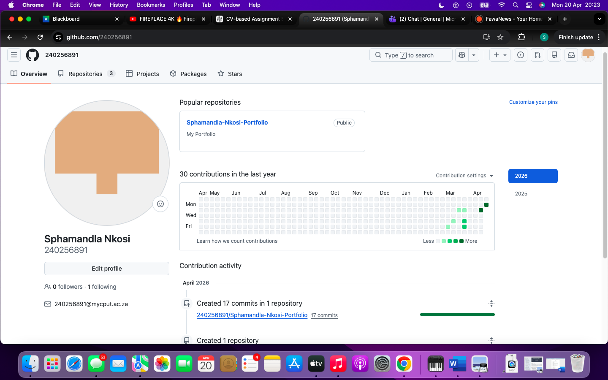

About Me

Motivated Application Development student at CPUT with strong skills in Java, SQL, and web development. Passionate about building efficient, user-focused applications.

---

 CV

Personal Info
- Name: Siphamandla Nkosi  
- Phone: 073 319 6355  
- Email: 240256891@mycput.ac.za  

---

Education
- CPUT – Diploma in ICT (In Progress)  
- Richfield College – Higher Certificate IT (2023)  
- Domino Servite School – Senior Certificate  

---

Work Experience
Department of Education**
- Managed exam papers  
- Ensured correct marking  

aQuelle Factory**
- Improved workflow efficiency  
- Coordinated production  

---

Skills
- Java, SQL, JavaScript  
- HTML, CSS  
- MySQL, Database Design  
- NetBeans, IntelliJ, Figma  

---

 Projects
- Website Development  
- Student System  
- Java Enrolment App  
- Calculator  

---
References

Dorothy Newlands  
- Position: School Principal  
- Organization: Domino Servite School  
- Phone: 032 481 5509  
- Email: mail@dss.org.za  

Mr G Songelwa  
- Position: Manager  
- Organization: aQuelle Factory  
- Phone: 032 492 0500  
- Email: mail@aquelle.co.za 

---

Mock Interview
src="https://youtube.com/shorts/W8aQ7YiMjC4

 Reflection: Coding in Markdown

**Situation:**  
As part of the digital portfolio assignment, I was required to use GitHub and present my CV using Markdown. This was my first time working with Markdown in a practical way, and I needed to ensure that my portfolio looked professional and well-structured.

**Task:**  
My task was to convert my existing CV into Markdown format while maintaining a clear structure and improving its readability. I also needed to ensure that the content was organized logically so that anyone viewing it could easily understand my qualifications, skills, and experience.

**Action:**  
To complete this task, I researched how Markdown works and learned how to use headings, bullet points, bold text, and horizontal lines effectively. I carefully divided my CV into sections such as personal details, education, work experience, technical skills, and projects. I focused on keeping the formatting consistent throughout the document and made adjustments to improve clarity and presentation. I also reviewed my work multiple times to ensure there were no formatting errors.
**Result:**  

As a result, I was able to create a clean, professional, and well-organized CV using Markdown. This process improved my technical documentation skills and gave me a better understanding of how developers present information on platforms like GitHub. I am now more confident in using Markdown for future academic and professional work.

Reflection: Mock Interview 

**Situation:**  
I participated in a mock interview as part of my work readiness training. The purpose of the interview was to simulate a real job interview environment and help me prepare for future employment opportunities.

**Task:**  
My task was to present myself professionally, answer interview questions confidently, and clearly communicate my skills, experience, and career goals. I also needed to demonstrate good communication skills and professional behavior throughout the interview.

**Action:**  
To prepare, I reviewed common interview questions and practiced my responses. During the interview, I focused on speaking clearly, maintaining eye contact, and staying calm under pressure. I explained my technical skills such as Java, SQL, and web development, and gave examples of projects I have worked on. I also tried to structure my answers properly so that they were easy to understand.

**Result:**  
The mock interview helped me improve my confidence and communication skills. I became more comfortable speaking about my abilities and experiences in a professional setting. I also identified areas where I can improve, such as being more concise in my answers and managing my time better. Overall, this experience prepared me for real interviews and increased my readiness for the workplace.

Reflection: GitHub Pages 

**Situation:**  
As part of the assignment, I was required to publish my digital portfolio online using GitHub Pages. This was my first experience deploying a project as a live website.

**Task:**  
My task was to configure my GitHub repository and ensure that all my portfolio content, including my CV and mock interview, was accessible through a live link. I also needed to make sure the portfolio was easy to navigate and presented in a professional way.

**Action:**  
I followed the steps to enable GitHub Pages and selected the correct branch for deployment. I ensured that all my files, such as the README, CV, and interview HTML page, were properly uploaded and linked. I tested the links to confirm they were working correctly and made adjustments where necessary. I also reviewed the layout of my portfolio to make sure it was clear and user-friendly.

**Result:**  
I successfully published my digital portfolio online and generated a working GitHub Pages link. This experience improved my understanding of how web deployment works and how developers share their work online. It also gave me a professional platform that I can use to showcase my skills to lecturers and potential employers.
